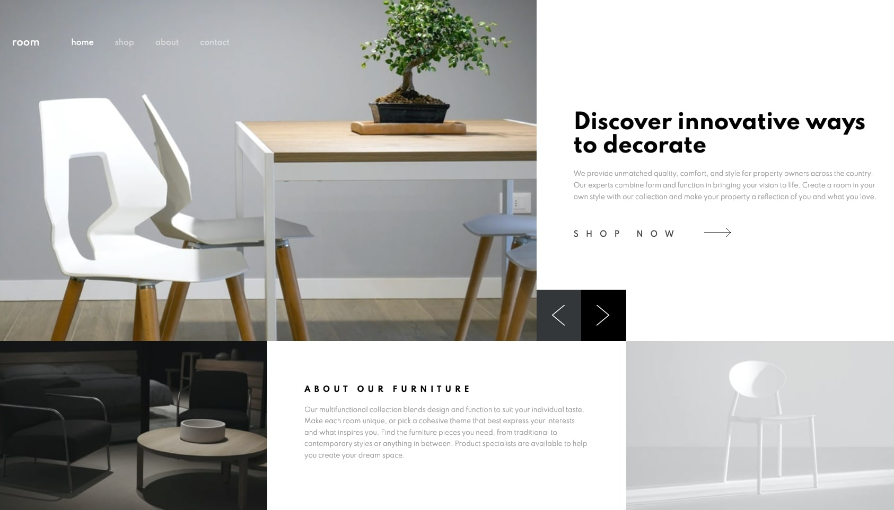

# Frontend Mentor - Room homepage solution

This is a solution to the [Room homepage challenge on Frontend Mentor](https://www.frontendmentor.io/challenges/room-homepage-BtdBY_ENq). Frontend Mentor challenges help you improve your coding skills by building realistic projects. 

## Table of contents

- [Overview](#overview)
  - [The challenge](#the-challenge)
  - [Screenshot](#screenshot)
  - [Links](#links)
- [My process](#my-process)
  - [Built with](#built-with)
  - [What I learned](#what-i-learned)
  - [Continued development](#continued-development)
  - [Useful resources](#useful-resources)
- [Author](#author)
- [Acknowledgments](#acknowledgments)

## Overview

### The challenge

Users should be able to:

- Hire me !

### Screenshot

### Links

- Solution URL: []
- Live Site URL: [https://fredlabdev.github.io/]

## My process

### Built with

- Semantic HTML5 markup
- CSS custom properties
- Bootstrap
- Flexbox
- GitHub

### What I learned

I learned to construct polylines svg elements (before to find svg files in /images folder...) <= Think about improving my reading of the data of a problem !

### Continued development

I ran out of time or rather organization, to set up the project in a structural way (CMS, PHP or MVC architecture). I focused on the design aspect, according to what I understood from the essentials asked in this test.

### Useful resources

[Bootstrap template] (https://startbootstrap.com/template/shop-homepage) - This dedicated bootstrap template helped me save time, not especially for the construction of the homepage, but to lay the foundations for a responsive architecture, notably in anticipation of the shop page of this e-commerce site.

[Bootstrap carousel] (https://getbootstrap.com/docs/4.3/components/carousel/) - Built-in bootstrap carousel functions saved me time for the HP slider.

[svg line/polyline] (https://jsfiddle.net/opeaucelle/692rkz90/) - Helped me to build responsive and vectorial arrows (Not necessary but what is done is done and allways usefull !)

## Author

- Website - [Mentor Frontend](https://fredlabdev.github.io/)
- Frontend Mentor - [@FredLabdev](https://www.frontendmentor.io/profile/FredLabdev)
- LinkedIn - [Frédéric LABOUREL](https://www.linkedin.com/in/frederic-labourel/)

## Acknowledgments

Pierre Marsanne for the confidence granted trusting me this challenge, and I hope after again !
